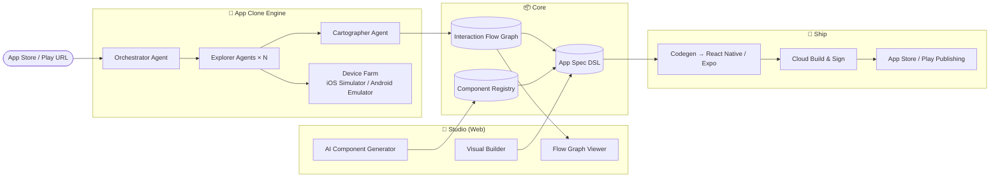

# Open App Studio

> Build, clone, and ship mobile apps like Lego — powered by AI agents.

[简体中文](./README.zh-CN.md) | English

**Open App Studio (OAS)** is an open-source platform for building mobile apps visually, with AI doing the heavy lifting:

- 🧱 **Build like Lego** — compose apps from blocks (screens, components, flows). AI generates any component you describe.
- 🤖 **Clone any app** — give the agent an App Store / Google Play link. A multi-agent crew installs the app on a device farm, explores every screen, learns all interaction paths, and produces an **Interaction Flow Graph (IFG)** — a replayable, visual map of the app that can be viewed, edited, and used as a blueprint to build your own version.
- 🚀 **Ship to stores** — one pipeline from canvas to signed builds and App Store / Google Play submission (iOS & Android).

## Status

🚧 **Active development.** The App Clone Engine (URL → live exploration → Interaction Flow Graph → editable blueprint → Expo codegen) and the Studio canvas work end to end. See [Roadmap](./docs/roadmap.md).

## Quick start

```bash
pnpm install
pnpm dev          # builds everything, then runs gateway (:4400) + studio (:3100); Ctrl+C stops both
```

Open **http://localhost:3100** and hit **▶ Clone** (empty input = fake-device demo, no emulator needed).

For real Android apps: have an emulator running with the target app installed (`adb install app.apk`), pick the **adb** driver, and set `ANDROID_HOME` / `OAS_LLM_API_KEY` in `.env` (see [`.env.example`](./.env.example)). Override ports with `GATEWAY_PORT` / `STUDIO_PORT`.

## Why

App builders existed for a decade; what changed is that AI agents can now *see* and *operate* apps. That unlocks two things no-code tools never had:

1. **Generation instead of configuration** — describe a component, get a working block.
2. **Learning from existing apps** — the best spec for "an app like X" is X itself. OAS turns a store link into a structured, buildable blueprint.

## Architecture at a glance



## Documentation

| Doc | What it covers |
|---|---|
| [Architecture](./docs/architecture.md) | System overview, tech stack, data flow |
| [App Clone Agent](./docs/app-clone-agent.md) | **v1 core feature** — multi-agent app exploration & learning |
| [Interaction Flow Graph](./docs/interaction-flow-graph.md) | The IFG data model + JSON schema |
| [Component System](./docs/component-system.md) | Block DSL, AI component generation, registry |
| [Build & Publish](./docs/build-and-publish.md) | Codegen, cloud builds, store submission |
| [Roadmap](./docs/roadmap.md) | Milestones M0–M4 |

## Repository layout (monorepo)

```
apps/
  studio/            # Next.js web app — visual builder + flow viewer
  gateway/           # API server — agent orchestration, jobs, auth
packages/
  flow-graph/        # IFG types, schema, graph operations
  clone-agents/      # Orchestrator / Explorer / Cartographer agents
  device-bridge/     # Driver adapters (Maestro, Appium, WDA, uiautomator2)
  app-spec/          # App Spec DSL — the buildable app definition
  component-registry/# Built-in blocks + AI-generated component store
  codegen/           # App Spec → React Native (Expo) code generation
schemas/             # JSON Schemas (IFG, App Spec)
docs/                # Design docs
```

## Legal & ethics

The Clone Engine learns **interaction structure** (screens, navigation, flows) — it does not extract or redistribute proprietary assets, code, or content. Outputs are blueprints regenerated by AI from structural understanding. Use responsibly and respect the terms of service of the apps you study. See [App Clone Agent → Guardrails](./docs/app-clone-agent.md#guardrails).

## License

[GPL-3.0](./LICENSE)
