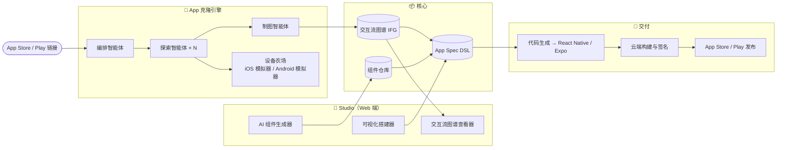

# Open App Studio

> 像搭积木一样构建、克隆、上架移动应用 —— 由 AI 智能体驱动。

简体中文 | [English](./README.md)

**Open App Studio (OAS)** 是一个开源平台，让你以可视化方式构建移动应用，繁重的工作交给 AI：

- 🧱 **像积木一样搭建** —— 用「区块」（页面、组件、流程）组合出应用，任何组件只需描述一句话，AI 即可生成。
- 🤖 **克隆任意 App** —— 给智能体一个 App Store / Google Play 链接，多智能体小队会在设备农场中安装该应用、遍历每个页面、学习全部操作路径，并产出一张 **交互流图谱（Interaction Flow Graph, IFG）**：一张可回放、可视化的应用地图，既能展示，也能作为蓝图直接用于搭建你自己的版本。
- 🚀 **一键上架** —— 从画布到签名构建、再到 App Store / Google Play 提交（iOS & Android），一条流水线打通。

## 当前状态

🚧 **开发中。** App 克隆引擎（链接 → 实时探索 → 交互流图谱 → 可编辑蓝图 → Expo 代码生成）与 Studio 画布已端到端打通。详见[路线图](./docs/roadmap.md)。

## 快速开始

```bash
pnpm install
pnpm dev          # 构建全部，然后同时启动 gateway (:4400) + studio (:3100)；Ctrl+C 一起关闭
```

打开 **http://localhost:3100**，点 **▶ Clone**（输入框留空 = 假设备演示，无需模拟器）。

克隆真实安卓应用：先让模拟器运行并装好目标应用（`adb install app.apk`），驱动选 **adb**，并在 `.env` 里配好 `ANDROID_HOME` / `OAS_LLM_API_KEY`（参见 [`.env.example`](./.env.example)）。端口可用 `GATEWAY_PORT` / `STUDIO_PORT` 覆盖。

## 为什么做这个

应用搭建工具已经存在十年了，真正的变化是：AI 智能体现在能够「看见」并「操作」应用。这解锁了两件 no-code 工具从未做到的事：

1. **生成取代配置** —— 描述一个组件，就得到一个能用的区块。
2. **向现有应用学习** —— 「做一个像 X 的应用」最好的需求文档就是 X 本身。OAS 把一个商店链接变成结构化、可搭建的蓝图。

## 架构总览



## 文档

| 文档 | 内容 |
|---|---|
| [架构设计](./docs/architecture.md) | 系统总览、技术栈、数据流 |
| [App 克隆智能体](./docs/app-clone-agent.md) | **v1 核心功能** —— 多智能体应用探索与学习 |
| [交互流图谱](./docs/interaction-flow-graph.md) | IFG 数据模型 + JSON Schema |
| [组件系统](./docs/component-system.md) | 区块 DSL、AI 组件生成、组件仓库 |
| [构建与发布](./docs/build-and-publish.md) | 代码生成、云端构建、商店提交 |
| [路线图](./docs/roadmap.md) | 里程碑 M0–M4 |

## 仓库结构（Monorepo）

```
apps/
  studio/            # Next.js Web 应用 —— 可视化搭建器 + 图谱查看器
  gateway/           # API 服务 —— 智能体编排、任务队列、鉴权
packages/
  flow-graph/        # IFG 类型定义、Schema、图操作
  clone-agents/      # 编排 / 探索 / 制图 智能体
  device-bridge/     # 驱动适配层（Maestro、Appium、WDA、uiautomator2）
  app-spec/          # App Spec DSL —— 可构建的应用定义
  component-registry/# 内置区块 + AI 生成组件仓库
  codegen/           # App Spec → React Native (Expo) 代码生成
schemas/             # JSON Schema（IFG、App Spec）
docs/                # 设计文档
```

## 法律与伦理

克隆引擎学习的是**交互结构**（页面、导航、流程），不提取、不分发受版权保护的资源、代码或内容。产出的蓝图由 AI 基于结构理解重新生成。请负责任地使用，并遵守所研究应用的服务条款。详见 [App 克隆智能体 → 安全护栏](./docs/app-clone-agent.md#guardrails)。

## 许可证

[GPL-3.0](./LICENSE)
