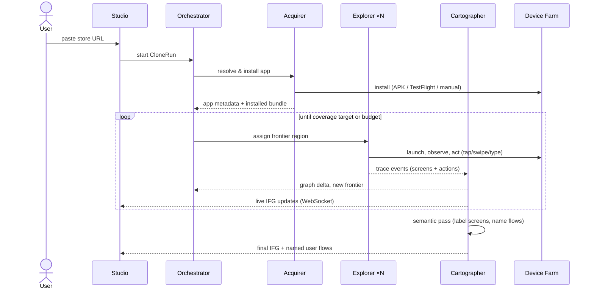

# App Clone Agent (v1 core feature)

> Input: an App Store / Google Play URL.
> Output: a complete **Interaction Flow Graph (IFG)** of the app — every screen, every interaction path — viewable in Studio and compilable into a buildable App Spec.

## 1. End-to-end flow



## 2. Stage 0 — Acquisition

Given a store URL, the **Acquirer** resolves what we can actually run:

| Source | What we get | How |
|---|---|---|
| Store listing page | Name, category, description, screenshots, reviews | Scrape store metadata (both stores have public pages) |
| **Android APK** | Installable app | User-supplied APK, or fetch from the store **with the user's own account credentials**; install to emulator via `adb` |
| **iOS app** | Installable app | User installs on simulator-compatible build if available, or on a **physical device** the user owns (WDA-driven); otherwise iOS exploration runs on user's device |
| Fallback: metadata-only | Blueprint without exploration | Store screenshots + description → LLM infers a *provisional* IFG (clearly marked as inferred, not observed) |

**v1 priority is Android emulator** (fully automatable end-to-end). iOS support ships as device-attached mode first. The metadata-only fallback means *every* URL produces something useful even when installation isn't possible.

Store metadata isn't just bootstrap data — screenshots and description seed the Explorer's *expectations* ("this is a food-delivery app; expect cart, checkout, order tracking"), making exploration goal-directed instead of random.

## 3. Stage 1 — Exploration (the agent crew)

### Roles

| Agent | Cardinality | Responsibility |
|---|---|---|
| **Orchestrator** | 1 | Owns the run: budget, frontier assignment, dedup, stop condition |
| **Explorer** | N (parallel devices) | Operates the app: observe → decide → act → record |
| **Cartographer** | 1 | Merges traces into the IFG: state dedup, edge canonicalization, frontier extraction |
| **Annotator** | 1 (post-pass) | Semantic labeling: names screens ("Login", "Cart"), groups them into user flows, tags component patterns |

### The Explorer loop

Each Explorer is a tool-using agent (Claude Agent SDK) bound to one device session:

```
observe:  screenshot + UI element tree (accessibility hierarchy)
perceive: fuse both → list of interactable elements with semantic guesses
decide:   pick next action to maximize NEW state discovery
            - prefer unvisited elements on current screen
            - prefer elements matching assigned frontier goal
            - synthesize realistic inputs for forms (test account, fake address)
act:      device-bridge call (tap / swipe / type / back / deep-link)
record:   emit TraceEvent {beforeState, action, afterState, screenshot, uiTree}
```

Key design points:

- **State identity** is the hard problem. A "screen state" is identified by a *structural fingerprint*: layout hash of the UI tree (element types + hierarchy, ignoring text content) + route hints (activity name on Android / accessibility identifier on iOS). Dynamic content (feed items, timestamps) changes the pixels but not the fingerprint → same node.
- **Vision + tree, not vision alone.** The accessibility/UI tree gives reliable selectors for replay; the screenshot gives the VLM semantic understanding the tree lacks (icons, images, visual grouping). Every recorded action stores both a tree selector and a screen-relative point, so paths replay robustly.
- **Parallelism**: the Orchestrator shards the frontier ("you take the Profile tab subtree, you take Search") across N emulators. Explorers are stateless beyond their device session — crash one, reassign its frontier.
- **Login walls & checkout**: the run pauses and asks the user for test credentials, or skips behind-the-wall regions (recorded as `blocked` frontier). Explorers never complete real payments — purchase flows stop at the final confirmation screen (`edge.terminal = "guarded"`).

### Stop condition

A run ends when any of: frontier exhausted (full coverage), discovery rate below threshold (e.g. <1 new state per 50 actions), or budget hit (action count / wall time / token spend). Coverage is reported honestly: `explored / discovered-but-unexplored / blocked`.

## 4. Stage 2 — Cartography (trace → graph)

The Cartographer consumes TraceEvents from all Explorers and maintains the canonical IFG:

1. **Node dedup** — match incoming states against existing fingerprints (exact hash → fast path; near-match → VLM judges "same screen?").
2. **Edge canonicalization** — multiple traces of "tap the cart icon" merge into one edge with multiple evidence samples.
3. **Frontier extraction** — interactable elements observed but never activated become frontier items, fed back to the Orchestrator.
4. **Semantic pass (Annotator)** — after structural convergence: label every node (`screen.role: login | feed | detail | cart | settings…`), detect **user flows** (named paths: "Onboarding", "Purchase", "Post content"), and tag per-screen **component patterns** (tab bar, infinite list, card grid, form) — these tags are what the Blueprint Compiler later maps onto registry components.

The IFG data model and JSON schema live in [interaction-flow-graph.md](./interaction-flow-graph.md).

## 5. Stage 3 — Outputs

1. **Live + final visualization** — Studio renders the IFG with React Flow: screenshot thumbnails as nodes, labeled action edges, flow lanes. Click any edge chain → replay the path (Maestro flow generated from recorded selectors) on a device, or scrub through recorded screenshots.
2. **Named user flows** — "this app's checkout takes 4 screens: Cart → Address → Payment → Confirm", each exportable as a Maestro YAML flow (doubles as an E2E test for the rebuilt app).
3. **Blueprint** — `app-spec` compiles the IFG (or a user-selected subgraph) into App Spec screens: component-pattern tags → registry components, edges → navigation wiring, observed forms → data models. The user lands on the Studio canvas with a draft app matching the cloned structure.

## 6. Failure modes & mitigations

| Risk | Mitigation |
|---|---|
| State explosion (infinite feeds, parameterized screens) | Structural fingerprinting collapses content-variants; per-screen action budget |
| Flaky automation (animations, network) | Wait-for-idle heuristics; retry with backoff; screenshots diffed before/after action |
| Anti-bot / jailbreak detection in target app | Run on stock emulator images; throttle action rate to human-like cadence; document that some apps will refuse |
| Hallucinated semantics | Every semantic label carries evidence (screenshot refs); labels are suggestions, user-editable in Studio |
| Cost blowup (VLM calls per action) | Tree-only fast path for obvious actions; VLM only on new states; small model for routine perception, big model for planning |

## 7. Guardrails

<a id="guardrails"></a>

- **Learn structure, not assets.** The IFG stores screenshots as *evidence for the user's own analysis*; the Blueprint Compiler regenerates UI from component patterns — it never copies images, icons, fonts, or text content into the generated app.
- **No DRM circumvention, no repackaging.** OAS installs apps through legitimate channels under the user's own accounts and never modifies or redistributes binaries.
- **No real-world side effects.** Guarded edges (payment, posting, messaging, account deletion) are never traversed past the confirmation boundary.
- **User responsibility.** Studying a competitor's UX for inspiration is normal practice; shipping a confusingly-similar copy may violate trademark/IP law and store policies. The docs and UI state this clearly.

## 8. v1 scope cut

In: Android emulator end-to-end (URL → IFG → blueprint), live graph view, path replay, metadata-only fallback for iOS.
Out (later): iOS simulator/device automation, parallel device farm >3, IFG diffing between app versions, automatic test-account creation.
