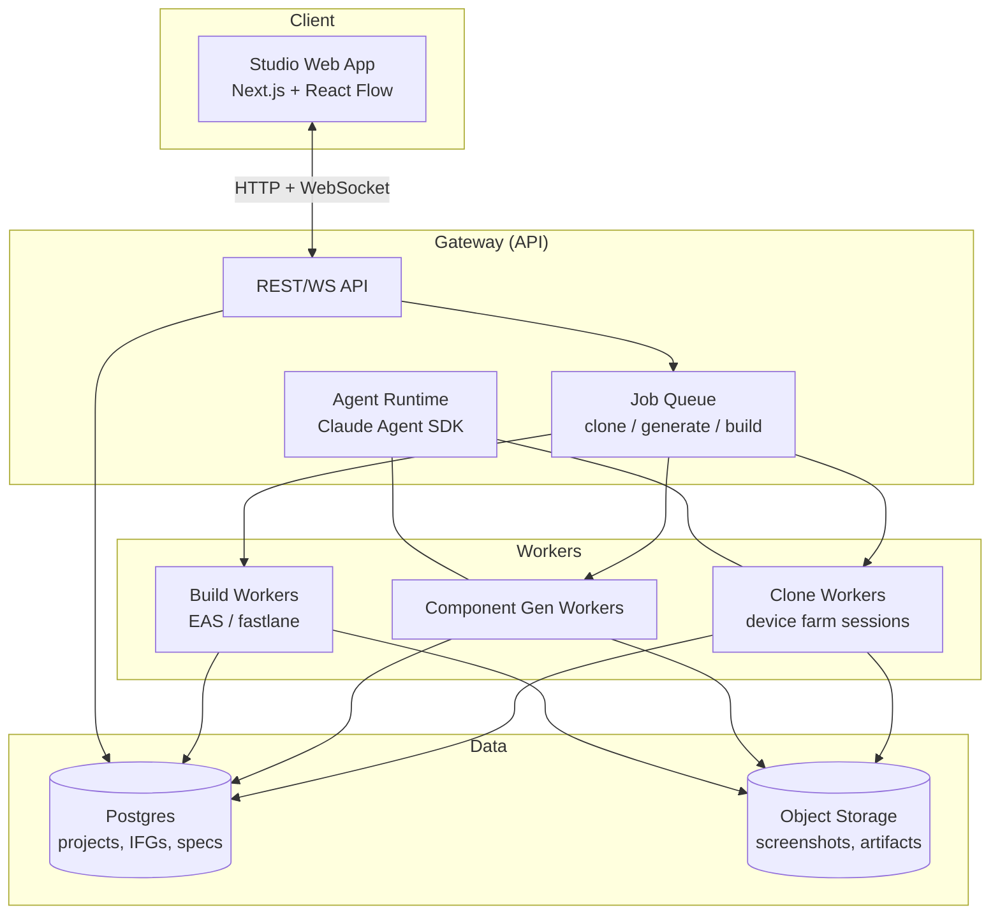

# Architecture

This document describes the overall system design of Open App Studio (OAS). Feature-level designs live in their own docs:
[App Clone Agent](./app-clone-agent.md) · [Interaction Flow Graph](./interaction-flow-graph.md) · [Component System](./component-system.md) · [Build & Publish](./build-and-publish.md).

## 1. Product surfaces

| Surface | What the user does there |
|---|---|
| **Studio** (web) | Visual builder canvas, AI chat sidebar, Flow Graph viewer, project management |
| **Clone Engine** | Paste a store link → watch agents explore the app live → receive an Interaction Flow Graph |
| **Ship pipeline** | One-click: generate code → cloud build → submit to App Store / Google Play |

## 2. System components



### Studio (`apps/studio`)
- **Stack**: Next.js (App Router), React Flow (graph canvas), shadcn/ui, Tailwind.
- **Builder canvas**: drag blocks from the registry, bind data, wire navigation.
- **Flow Graph viewer**: renders an IFG — screenshots as nodes, actions as edges; supports replay ("walk this path"), diffing two IFGs, and *promote-to-app* (turn a subgraph into App Spec screens).
- **AI sidebar**: conversational interface to the same agents ("add a checkout flow like the one in the cloned graph").

### Gateway (`apps/gateway`)
- **Stack**: Node.js (Hono or NestJS), Postgres, BullMQ (Redis) job queue.
- Owns auth, projects, and long-running **jobs** (clone runs, component generations, builds). Jobs stream progress to Studio over WebSocket — a clone run is a *live show*: users watch agents tap through the app in real time.

### Agent Runtime (`packages/clone-agents`)
- Built on the **Claude Agent SDK** (TypeScript). Each agent is a tool-using loop; tools are provided by `device-bridge` (tap, swipe, type, screenshot, dump UI tree) and `flow-graph` (add node/edge, query graph).
- Multi-agent topology is described in [App Clone Agent](./app-clone-agent.md).

### Device Bridge (`packages/device-bridge`)
A uniform driver interface over heterogeneous automation backends:

| Backend | Platform | Used for |
|---|---|---|
| **Maestro** | iOS + Android | Default driver — simple, fast, YAML-replayable flows |
| **Appium (WDA / uiautomator2)** | iOS + Android | Fallback for gestures Maestro can't express; raw element tree access |
| **`xcrun simctl` / `adb`** | iOS / Android | App install, deep links, permissions, device lifecycle |

The bridge exposes one capability set to agents: `screenshot()`, `uiTree()`, `tap(selector|point)`, `swipe()`, `type()`, `back()`, `launch()`, `deepLink()`. Everything an agent does is recorded as a **trace** — the raw material of the IFG.

### Data model (core entities)

```
Project ─┬─ AppSpec (the buildable definition, versioned)
         ├─ CloneRun ─── InteractionFlowGraph ─── ScreenNode / ActionEdge / Asset(screenshot)
         ├─ Component (AI-generated or built-in, in registry)
         └─ Build ─── StoreSubmission
```

## 3. The central abstraction: two graphs, one bridge

OAS deliberately separates **what an app *is*** from **what an app *does***:

- **Interaction Flow Graph (IFG)** — *observed behavior*. Produced by the Clone Engine. Descriptive, evidence-backed (every node has screenshots + UI trees).
- **App Spec** — *buildable definition*. Consumed by codegen. Prescriptive: screens, components, navigation, state, data.

The **Blueprint Compiler** (`packages/app-spec`) bridges them: it takes an IFG (or a subgraph), asks an agent to interpret each screen into registry components, and emits App Spec screens with navigation wired to match the observed flows. The user reviews and edits the result on the canvas — cloning is a *draft*, not a verbatim copy.

```
Store URL → [Clone Engine] → IFG → [Blueprint Compiler] → App Spec → [Codegen] → Expo project → [Build] → Stores
                                        ↑
                              Canvas edits / AI generation
```

## 4. Tech stack decisions

| Decision | Choice | Why |
|---|---|---|
| App runtime target | **React Native + Expo** | One codebase → iOS + Android; EAS gives cloud build/sign/submit; biggest ecosystem for AI codegen |
| Studio framework | **Next.js** | Mature, deployable anywhere (Vercel/self-host) |
| Agents | **Claude Agent SDK (TS)** | Native tool-use loops, subagents, structured output |
| Default device driver | **Maestro** | Lowest-friction cross-platform automation; flows double as replay scripts |
| Graph store | **Postgres (JSONB) + object storage** | IFGs are document-shaped; screenshots are blobs |
| Queue | **BullMQ / Redis** | Clone runs and builds are long jobs needing progress + retry |
| Monorepo | **pnpm + Turborepo** | Standard TS monorepo tooling |

## 5. Deployment modes

1. **Local-first (default for OSS)** — everything on the developer's machine: Studio on localhost, simulators/emulators locally, SQLite/Postgres in Docker. `pnpm dev` and go.
2. **Self-hosted** — Gateway + workers on a server; macOS runners (for iOS simulators) attach as device-farm nodes.
3. **Cloud (future)** — managed device farm, shared component registry, team workspaces.

## 6. Non-goals (v1)

- No custom mobile runtime/interpreter — we generate real Expo projects, not a player shell.
- No pixel-perfect asset extraction from cloned apps (see [guardrails](./app-clone-agent.md#guardrails)).
- No web app targets (mobile first; the IFG model is platform-agnostic so web can come later).
