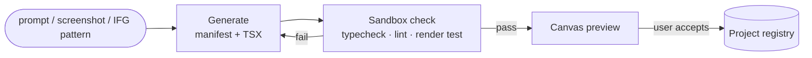

# Component System

How OAS represents apps as composable blocks, and how AI generates new blocks on demand.

## 1. Three layers

```
App Spec (DSL)          — the app: screens, navigation, state, data bindings
  └── Components        — the blocks: typed, themable, data-bindable units
        └── Primitives  — React Native / Expo elements (View, Text, FlatList, …)
```

### App Spec (`packages/app-spec`)

A JSON document (versioned, schema-validated) that fully describes a buildable app:

```jsonc
{
  "app": { "name": "FoodFast Clone", "theme": { "ref": "themes/warm" } },
  "navigation": {
    "type": "tabs",
    "tabs": [
      { "id": "home", "screen": "scr_home", "icon": "home" },
      { "id": "cart", "screen": "scr_cart", "icon": "cart" }
    ]
  },
  "screens": [
    {
      "id": "scr_cart",
      "title": "Cart",
      "components": [
        { "ref": "oas/cart-item-list", "props": { "items": "$state.cart.items" } },
        { "ref": "oas/primary-button", "props": { "label": "Checkout", "onPress": { "navigate": "scr_address" } } }
      ]
    }
  ],
  "data": {
    "models": [{ "name": "CartItem", "fields": [{ "name": "title", "type": "string" }, { "name": "qty", "type": "int" }] }],
    "sources": [{ "kind": "rest", "baseUrl": "$env.API_URL" }]
  }
}
```

Design rules:
- **Declarative only** — no embedded code in the spec. Custom logic lives in components.
- **Everything referenceable** — components by registry ref, data by binding path, themes by ref. The canvas, the AI sidebar, and the Blueprint Compiler all manipulate the same document.
- **Diffable & versioned** — every canvas edit is a JSON patch; undo/redo and AI-proposed changes are reviewable diffs.

## 2. Components (`packages/component-registry`)

A component is a folder with a manifest + implementation:

```
components/oas/cart-item-list/
├── manifest.json     # name, props schema (JSON Schema), preview, tags, pattern-kinds it satisfies
├── component.tsx     # React Native implementation
├── preview.png
└── stories.tsx       # canvas preview states
```

Manifest essentials:
- **`props` schema** — typed contract; the canvas auto-generates the props inspector from it.
- **`patterns`** — which IFG `ComponentPattern` kinds this block can realize (e.g. `["list", "card"]`). This is the lookup key the Blueprint Compiler uses: *IFG says "this screen has a card grid" → registry query `pattern: grid` → candidate components*.
- **`slots`** — named children regions, so blocks compose (a `Card` exposes `header/body/footer` slots).

### Built-in library (v1)

~30 blocks covering the patterns the Annotator detects: navigation (tab bar, stack header, drawer), collections (list, grid, carousel, infinite feed), content (card, detail header, media, map, webview), forms (input, picker, stepper, form group), commerce (cart list, price row, checkout summary), feedback (dialog, toast, empty state, skeleton).

## 3. AI component generation

When no registry block fits ("I need a circular progress ring with a gradient"), the **Component Generator** agent creates one:



- **Inputs**: natural-language description, and optionally a screenshot region (from an IFG node) to match visually — *match the look by regenerating, never by copying assets*.
- **Constraints baked into the generation prompt**: RN/Expo primitives only, props-driven (no hardcoded content), theme tokens for all colors/spacing/typography, accessibility props required.
- **Sandbox**: generated TSX must pass `tsc`, ESLint, and a headless render (react-test-renderer) before it reaches the user. Failures loop back with the error as feedback (max 3 attempts).
- **Scope**: generated components land in the *project* registry; users can promote them to a shared/community registry later.

## 4. Theming

A theme is a token set (colors, typography, spacing, radii, elevation) referenced by all components. The Annotator extracts a *palette suggestion* from IFG screenshots (dominant colors, font scale estimate) so a cloned blueprint starts visually in the neighborhood of the original — but with regenerated, token-driven styling.

## 5. Canvas ↔ AI contract

Both the human (canvas drag/drop) and the AI sidebar edit the App Spec through the same patch API:

```
proposePatch(spec, instruction | ifgSubgraph) → JSON Patch + rationale
applyPatch / revertPatch
```

This keeps one source of truth and makes every AI change inspectable before apply — the same review-the-diff model developers already trust.
